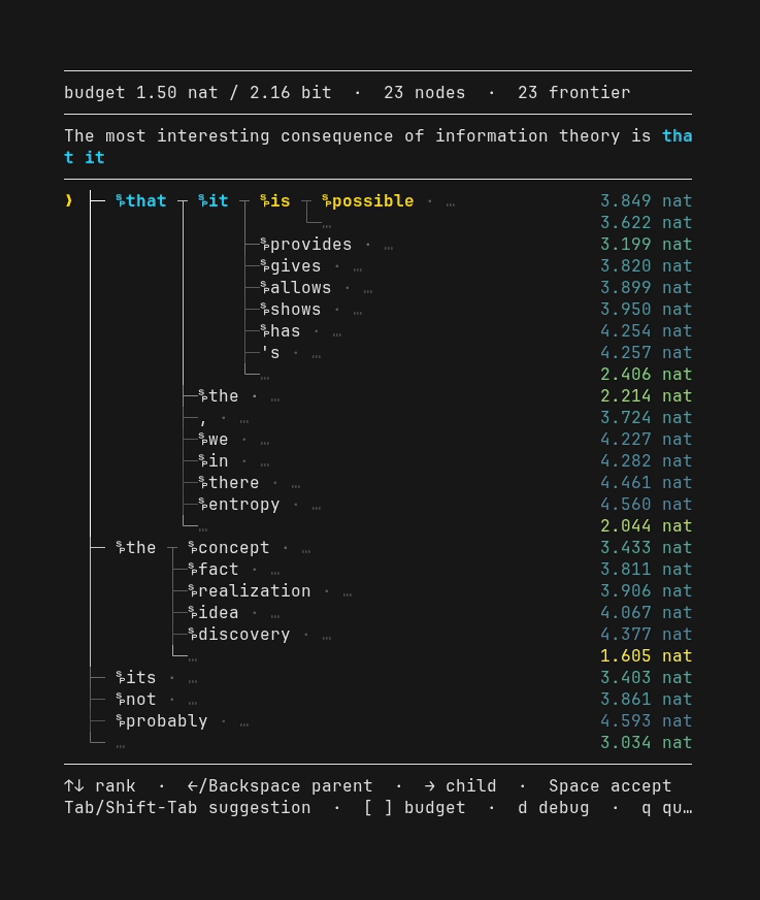
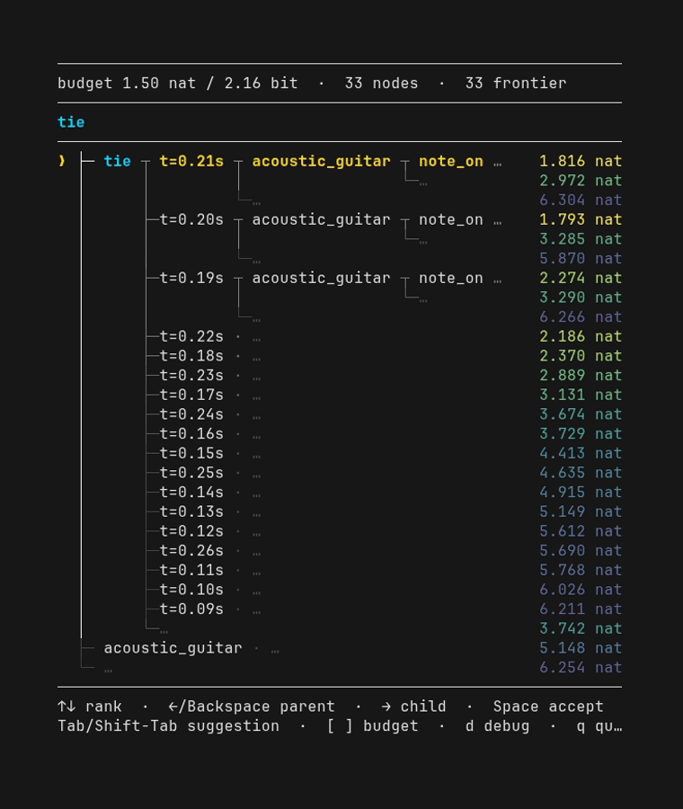

# natwalk

<p align="center">
  <a href="assets/demo-qwen.gif">
    
  </a>
  <a href="assets/demo-muscriptor.gif">
    
  </a>
</p>

**Navigate autoregressive distributions in information space.**

`natwalk` is a model-agnostic interaction and search layer for causal probabilistic models. A backend exposes a complete next-symbol distribution and a rewindable causal cursor; Natwalk explores likely continuations in surprisal distance while the user navigates the discovered probability tree.

The core intentionally has no top-k/top-p truncation.

## Model interface

A backend is one rewindable causal cursor:

```python
from collections.abc import Sequence


class Cursor:
    def predict(self) -> Sequence[float]:
        """Return the complete normalized next-symbol distribution.

        Return an empty sequence at end of generation.
        """

    def observe(self, token: int) -> None:
        """Advance the causal state by one token."""

    def checkpoint(self) -> object:
        """Return a cheap rewind point."""

    def restore(self, checkpoint: object) -> None:
        """Restore a previous rewind point."""
```

Natwalk trusts the distribution contract. It does not silently normalize or truncate model output.

## Search in information distance

For an edge with conditional probability `p`, Natwalk uses

```text
edge cost = -ln p
```

and runs uniform-cost search from the current causal root. Because each complete distribution is stored in descending probability order, sibling edge costs are already sorted. The search therefore keeps only the next sibling from each active parent on the heap: a lazy k-way merge that produces the same order as eager Dijkstra without inserting an entire vocabulary into the frontier.

`Search.step()` advances exactly one Dijkstra transition. `Search.discover()` additionally fast-forwards already-known edges after rerooting and stops at the next genuinely new node.

## One append-only probability tree

`Tree` is the discovered model knowledge.

Every published node is complete and immutable with respect to its distribution:

```text
parent node id
rank within the parent's distribution
complete ranked distribution
map of discovered child ranks -> node ids
```

Vocabulary children remain virtual until their distribution is actually discovered. Tokens, edge surprisal, paths, depth, and cumulative path cost are derived rather than duplicated as mutable state.

Rerooting never deletes discovered knowledge. Search scheduling is reset relative to the new root, while the append-only tree is retained and reused.

## Process-isolated interactive engine

The interactive TUI runs model execution in a spawned worker process. The worker owns the authoritative `Session`, cursor, search frontier, and causal history; the UI receives an idempotent append-only `TreeReplica`.

Known navigation can be queued optimistically. The visible cursor moves immediately through already-discovered edges while authoritative `Advance` / `Rewind` commands catch up in FIFO order. If the UI reaches an undiscovered edge, that edge becomes a natural barrier until its child distribution arrives.

This keeps the terminal responsive without giving the UI a second mutable copy of model/search state.

## Probability-partition TUI

The terminal renderer treats vertical space as a probability budget.

Every physical row represents exactly one disjoint continuation event. Starting from the whole visible continuation mass, each additional row refines one currently visible event into two disjoint events. Renderer structure never creates extra semantic rows.

The selected events are then laid out as a leaf-only radix trie:

- shared prefixes are factored horizontally;
- internal trie nodes consume columns, never rows;
- long unary paths stay collapsed on one line;
- branch connectors attach at the actual token boundary where paths diverge;
- branch grayscale represents aggregate displayed probability mass;
- right-hand nat values are cumulative surprisal from the visible causal cursor.

The result is a dense view of model uncertainty that scales from language-model vocabularies to structured symbolic models.

## Terminal controls

```text
↑ / ↓             select sibling rank
← / Backspace     rewind one causal edge
→                 advance into selected child
Space             accept highlighted completion
Tab / Shift-Tab   cycle suggestions
[ / ]             change completion budget
d                 debug state
q                 quit
```

## Demos

### llama.cpp / GGUF

`examples/llm_app.py` adapts any local GGUF model through `llama-cpp-python`:

```bash
uv run --with-editable . examples/llm_app.py \
  "The most interesting consequence of information theory is" \
  --model-path /path/to/model.gguf
```

It can also resolve an existing Ollama model directly:

```bash
uv run --with-editable . examples/llm_app.py \
  "The most surprising thing about information theory is" \
  --model ministral-3:14b
```

### Hugging Face Transformers

`examples/hf_app.py` adapts standard PyTorch causal language models through `transformers` without adding either Transformers or PyTorch to Natwalk's core dependencies:

```bash
uv run --with-editable . examples/hf_app.py \
  "The most interesting consequence of information theory is" \
  --model Qwen/Qwen3-0.6B
```

The model id is the only model-specific input. `--device`, `--dtype`, `--tokenizer`, and `--context-length` control execution without changing Natwalk code. The adapter keeps checkpoints as lightweight token snapshots and reconstructs each requested causal state with an ordinary full-context forward, so it does not depend on model-specific KV-cache snapshot APIs.

### MuScriptor

`examples/muscriptor_app.py` adapts MuScriptor's causal music-transcription distribution to the same Natwalk cursor contract:

```bash
uv run --with-editable . examples/muscriptor_app.py \
  "../muscriptor/samples/Laura Marling - What He Wrote.mp3" \
  --model medium \
  --device cuda \
  --chunk 0
```

MuScriptor itself does not depend on Natwalk; the integration lives entirely in the example adapter.

## Library API

The core pieces are usable independently of the TUI:

```python
from natwalk import Session, completions, greedy

session = Session(cursor)
session.search.discover()

best = greedy(session.tree, session.root, max_nats=1.5)
options = completions(session.tree, session.root, max_nats=1.5)
```

`greedy()` and `completions()` are read-only queries over already-discovered tree state. They never call the model or mutate search.

`Navigation` remains available as an optional equal-information interaction layer. It performs arithmetic interval narrowing and commits a token only when the chosen interval forces that token; the TUI itself uses direct causal tree navigation instead.

## Design invariants

The test suite pins the properties Natwalk depends on:

- lazy sibling search matches eager full-frontier Dijkstra on randomized finite trees;
- every tree node is published complete or not published at all;
- conflicting duplicate publication fails instead of being silently repaired;
- tree synchronization is ordered, resumable, and idempotent;
- model speculation restores the committed cursor;
- browsing does not change search scheduling;
- queued causal navigation converges exactly to the authoritative engine root;
- every rendered probability row is one disjoint event and partition mass is conserved;
- terminal layout is measured in display cells rather than Python string length.

See [`ARCHITECTURE.md`](ARCHITECTURE.md) for the ownership model and runtime protocol.
